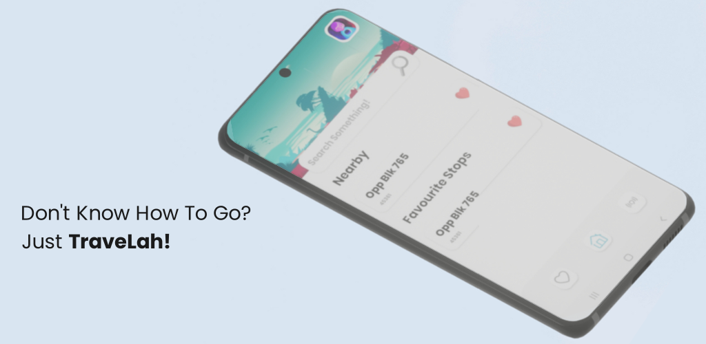

# TraveLah

<h2> TraveLah</h2>

For the Assignment, our team decided to create a travel app, named TraveLah.
Our goal was to create a travel app that had a focus on travel in Singapore. 
We aim to make travel simple, fun and uncomplicated for all Singaporeans so that they can just TraveLah!

Why TraveLah?:

### ⚒️ Tools
* [Android Studio](https://developer.android.com/studio)
* [Figma](https://www.figma.com/)
* [Firebase](https://firebase.google.com)

[XD Design](https://xd.adobe.com/view/41c34446-1eb9-4357-9d29-d18e8258339c-1490/?fullscreen)

## 📲 Playstore Listing

## Use guide

1. Grant app location permissions

## Features

1. Get bus stops near you & display all the timings of the respective buses
2. Favourite a bus stop and save it
3. Search for bus stops by name
4. Search autocomplete

## Contributions
  
Contributions of each student:

* Jimmy Lew Kwong Yi - S10219505
    * Design 
        * Design UI / UX
    * Android
        * Implement Bus Timing Card Triple Nested Recycler
        * Implement Bus Timing API
        * Implement Bus Search
        * Implement & Synchronize other misc features
        * Implement responsive layout
        * General bug fixes
        * Code documentation
        * Code upkeep & refactoring
    * Custom API
    * Firebase
        * Implement RTDB
    * App submission
  
* Addison Chua Jie Yi - S10222525

  
* Paul M Lim Wen Chuan - S10222819

  
* Ryan Lim Junquan - S10192609

    
* Lucas Ho - S10227850

## Acknowledgments

### Tools
* Design: [Adobe XD](https://www.adobe.com/sg/products/xd.html)
* IDE: [Android Studio](https://developer.android.com/studio/)
* Project Management: [Notion](https://notion.so)
  
### Res  
#### Design Refs
* [Dribbble](https://dribbble.com/)

#### Code Refs
* [Firebase Documentation](http://firebase.google.com/docs/firestore/manage-data/add-data)
* [Android Developer Documentation](https://developer.android.com/)
  
### Assets
* [Poppins - Google fonts](https://fonts.google.com/specimen/Poppins)