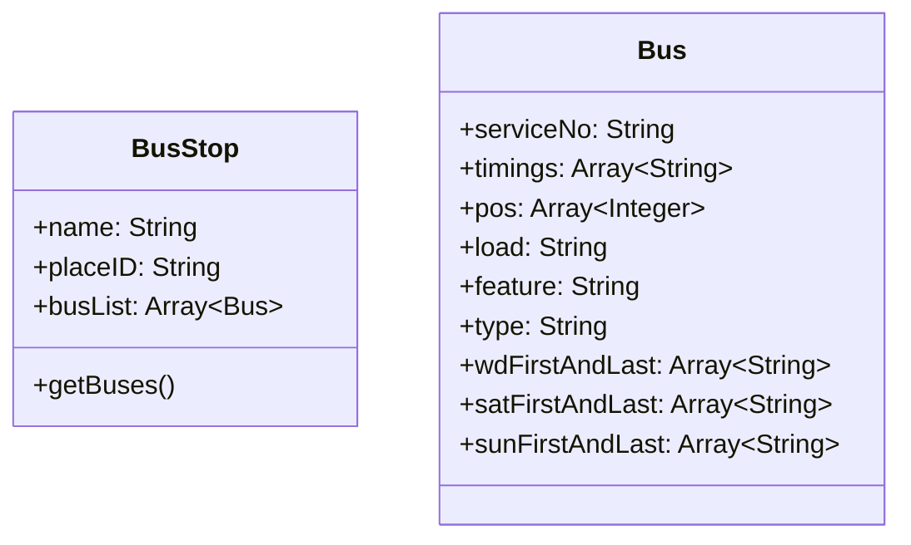

# Class-Diagrams

```mermaid
classDiagram
    class BusStop {
        +name: String
        +placeID: String
        +busList: Array~Bus~

        +getBuses()
    }

    class Bus {
        +serviceNo: String
        +timings: Array~String~

        +pos: Array~Integer~
        +load: String
        +feature: String
        +type: String

        +wdFirstAndLast: Array~String~
        +satFirstAndLast: Array~String~
        +sunFirstAndLast: Array~String~
    }

```