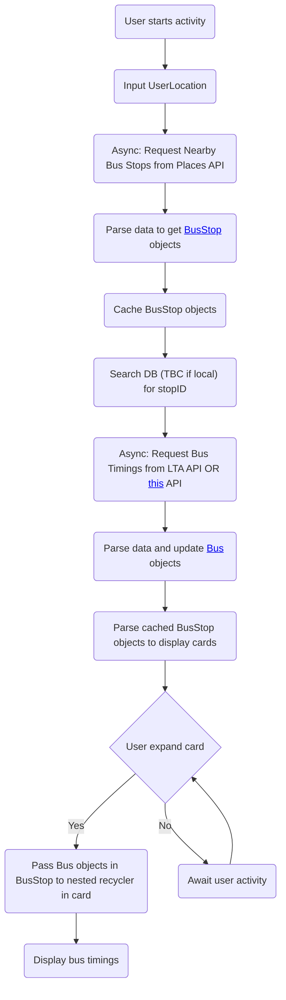

# See Nearby Bus Stops

Shows all nearby bus stops and the relevant bus timings for it's respective buses

```mermaid
flowchart TD
    A(User starts activity) --> B(Input UserLocation)

    B --> C(Async: Request Nearby Bus Stops from Places API)
    C --> D(Parse data to get <a href='./class-diagram.md'>BusStop</a> objects)
    D --> E(Cache BusStop objects)
    E --> Ee("Search DB (TBC if local) for stopID")
    Ee --> F(Async: Request Bus Timings from LTA API OR <a href='https://github.com/cheeaun/arrivelah'>this</a> API)
    F --> G(Parse data and update <a href='./class-diagram.md'>Bus</a> objects)
    G --> H(Parse cached BusStop objects to display cards)
    H --> I{User expand card}

    I --> |Yes| J(Pass Bus objects in BusStop to nested recycler in card)
    J --> K(Display bus timings)

    I --> |No| L(Await user activity)
    L --> I
```